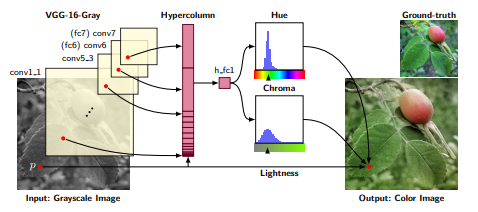
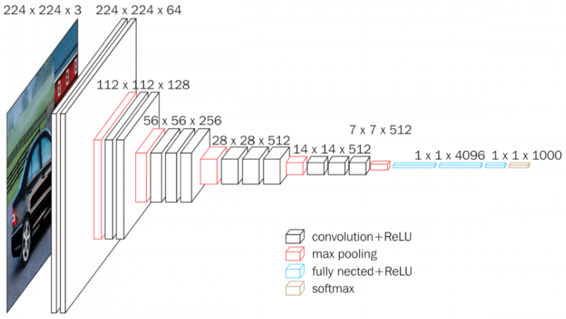
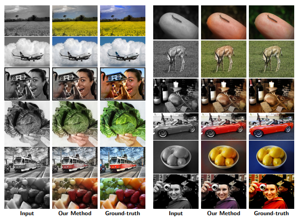
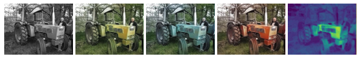
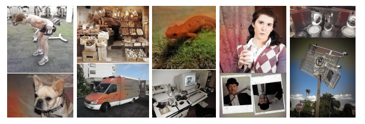

# `<Estudo sobre Colorização Automática de Imagens Preto e Branco>`
# `<Automatic Colorization of Black and White Images>`

## Apresentação

O presente projeto foi originado no contexto das atividades da disciplina de graduação *EA979A - Introdução a Computação Gráfica e Processamento de Imagens*, 
oferecida no primeiro semestre de 2022, na Unicamp, sob supervisão da Profa. Dra. Paula Dornhofer Paro Costa, do Departamento de Engenharia de Computação e Automação (DCA) da Faculdade de Engenharia Elétrica e de Computação (FEEC).

> Integrantes
> |Nome  | RA | Curso|
> |--|--|--|
> | Caio Eduardo Ferraz da Silva  | 195203  | Eng. Elétrica|
> | Victor Rodrigues Laterza  | 206601  | Eng. de Computação|

## Descrição do Projeto
> A ideia de transformar uma imagem em tons de cinza em uma imagem colorida é bastante desafiadora e interessante por si só. Pois, para que uma colorização ocorra de forma verossímil, ou seja, se aproximando de uma imagem com cores reais, há a necessidade de se ter um conhecimento prévio sobre o que está sendo representado pela imagem. Partindo deste pressuposto e movidos, à priori, pela curiosidade, decidimos estudar ferramentas no estado da arte, e, posteriormente, desenvolver uma técnica própria, o que se mostrou inviável no decorrer do desenvolvimento do projeto.
> 
> Desse modo, o foco do projeto como um todo se voltou em estudar e compreender passo a passo o funcionamento de uma dessas técnicas. Desse modo, escolhemos focar na leitura do artigo de 2017, "Learning Representations for Automatic Colorization" de Gustav Larsson, Michael Maire e Gregory Shakhnarovich, que se apresenta uma ferramenta bastante avançada quanto à sua acurácia, demonstração dos princiais tipos de erros gerados, e contribuições para a aplicação de modelos de aprendizagem visual auto-supervisionado.

## Abordagem Adotada
> Nosso estudo foi divido em algumas etapas:
 
### Exposição sobre o artido estudado:
> Neste artigo desenvolveu-se um sistema de colorização de imagem totalmente automático. Nele, exploraram-se representações de baixo nível e semânticas, aproveitando avanços em redes profundas. Assim, buscou-se treinar este modelo para que fosso possível prever histogramas de cores por pixel, a qual pode ser usada para gerar automaticamente uma imagem colorida ou manipulada adicionalmente antes da formação da imagem. Por fim, explorou-se a colorização como uma aplicação para o aprendizado de representação visual auto-supervisionada. E superando os métodos existentes [1].

### Base de Dados:
> ImageNet é um conjunto de dados de mais de 15 milhões de imagens rotuladas de alta resolução pertencentes a aproximadamente 22.000 categorias. As imagens foram coletadas da web e rotuladas por rotuladores humanos usando a ferramenta de crowdsourcing Mechanical Turk da Amazon. A partir de 2010, como parte do Pascal Visual Object Challenge, uma competição anual chamada ImageNet Large-Scale Visual Recognition Challenge (ILSVRC) foi realizada. O ILSVRC usa um subconjunto do ImageNet com aproximadamente 1.000 imagens em cada uma das 1.000 categorias. Ao todo, existem cerca de 1,2 milhão de imagens de treinamento, 50.000 imagens de validação e 150.000 imagens de teste. ImageNet consiste em imagens de resolução variável. Portanto, as imagens foram reduzidas para uma resolução fixa de 256×256. Dada uma imagem retangular, a imagem é redimensionada e recortada no ponto central de 256×256 da imagem resultante.

### Metodologia utilizada:
> - Preparação dos dados:
>   - Luminosidade: para fazer o treinamento de dados, foi feito uma conversão da cor das imagens para escala de cinza, de acordo com a média aritmética dos valores RGB da imagem, isto é, foi definido L como a luminosidade, tal que L = (R+G+B)/3. Com esta simples técnica, foi possível fazer a dessaturação das imagens e utilizá-la na previsão de cores.
>   - Hue/chroma: ao invés de utilizar L como a matiz de cores de saída, foi utilizado espaços baseados em matiz, como por exemplo, o HSL que pode ser representado por um  cilindro com coordenada angular H (matiz), distância radial S (saturação) e altura L (luminosidade). Porém devido a instabilidades que ocorrem nas cores branco e preto, eventualmente foi pensado no espaço HSV, que só tem instabilidade no preto. Finalmente, para resolver as instabilidades e manter o canal L, foi feio um bicone tal que o canal S foi substituído pelo C (Chroma) na saturação. A conversão feita do HSV é dada por V = L+C/2 e S = C/V.
>   - Lab: Lab(L.a.b) foi projetado para ser linear. Um vetor (a,b) define um espaço Euclidiano onde a distância do vetor até a origem define o chroma.
>   - Loss: baseado no artigo [2], foi utilizado uma técnica para mensurar a perda, por meio de histogramas.

## Arquitetura e treinamento da rede neural:

### VGG-16:
> A rede neural utilizada como base é uma versão totalmente convolucional do VGG-16, na qual utiliza-se como entrada uma imagem RGB, a qual irá passar por uma pilha de camadas convolucionais, utilizando filtros muito pequenos, máscaras 3x3 (que é o menor tamanho para capturar a noção de esquerda/direita, cima/baixo, centro ). Podendo-se utilizar também filtros de convolução 1x1 que podem ser vistos como uma transformação linear dos canais de entrada (seguida de não linearidade) [3].
>
> Em seguida, o input passa por uma sequência de camadas convolucionais, seguidas de um pooling máximo realizado em uma janela 2x2, e, desse modo, diminuindo seu tamanho pela metade do seguinte modo:
> - Tamanho:224x224 (duas camadas convolucionais + pooling);
> - Tamanho:128x128 (três camadas convolucionais + pooling);
> - Tamanho:56x56 (três camadas convolucionais + pooling);
> - Tamanho:28x28 (três camadas convolucionais + pooling);
> - Tamanho:14x14 (três camadas convolucionais + pooling).
>
> Em seguida, apresentam-se três camadas totalmente conectadas, que seguem uma pilha de camadas convolucionais de aprendizado profundo:sendo as duas primeiras com  4.096 canais cada, e a terceira realizando uma classificação ILSVRC de 1.000 vias e. A camada final é a camada soft-max. Além disso, todas as camadas ocultas são equipadas com a não linearidade de retificação (ReLU) [4].

> Porém, nesse artigo, utilizou-se a VGG-16 com duas mudanças: (1) a camada de classificação é descartada e (2) a primeira camada de filtro opera em um canal de intensidade única devido à preparação de dados, e por conta disso temos uma VGG-16-Gray. Além disso, vale destacar, que seu desenvolvimento inicializou com uma versão do VGG-16 pré-treinada no ImageNet, adaptando-a à escala de cinza pela média dos canais de cores na primeira camada e redimensionando adequadamente. Antes do treinamento para colorização, ajustamos ainda mais a rede para uma época na tarefa de classificação ImageNet com entrada em escala de cinza. 

### Hipercolunas:
> Muitos algoritmos que utilizam recursos de CNNs (Convolutional Neural Networks) costumam usar os últimos recursos da camada totalmente conectadas para extrair informações sobre determinada entrada. No entanto, as informações na última camada podem ser muito grosseiras espacialmente para permitir uma localização precisa (devido a sequências de max-pooling, por outro lado, as primeiras camadas podem ser espacialmente precisas, mas possuem poucas informações semânticas. Para obter o melhor dos dois mundos, utiliza-se a hipercoluna de um pixel como o vetor de ativações de todas as unidades CNN “acima” desse pixel [4].
>
> O primeiro passo na extração das hipercolunas é alimentar a imagem na CNN (Convolutional Neural Network) e extrair as ativações do mapa de características para cada local da imagem. Essa hipercoluna é muito interessante porque conterá informações sobre as primeiras camadas (onde temos muita informação espacial, mas pouca semântica) e também informações sobre as camadas finais (com pouca informação espacial e muita semântica). Assim, esta hipercoluna certamente ajudará em muitas tarefas de classificação de pixels, como a colorização automática, pois cada hipercoluna de localização carrega as informações sobre o que esse pixel representa semanticamente e espacialmente. Isso também é muito útil em tarefas de segmentação [4].

## Resultados Finais
> Para os experimentos, o sistema foi treinado em uma época com 1,2 milhões de imagens do site ImageNet. Cada época leva aproximadamente 17 horas numa GTX Titan X GPU.
> No processo de teste, foram utilizadas duas métricas: RMSE e PSNR. RMSE significa "root mean square error", o erro quadrático sob o espaço Euclidiano "ab". O PSNR significa "peak signal-noise ratio", a relação do pico do sinal-ruído da imagem em RGB.
> Para obter resultados satisfatórios, foram necessários cerca de 10 épocas de treinamento para as imagens.

> Percebe-se que os resultados foram satisfatórios, de modo que à primeira vista sem ter visto a imagem original, é facilmente aceitável como uma imagem real.

> Além disso, é possível obter as imagens em seus três espectros de cores (RGB) e seu mapa de calor.

> Porém, ainda houveram resultados que nitidamente apresentam erros como fundos incongruentes, falta de cor (monocromático), cores inconsistentes, textura confusa etc.

## Discussão
> Vale destacar, que a partir deste estudo, pudemos conhecer e compreender um sistema que demonstra capacidade de última geração para colorir automaticamente imagens em tons de cinza. Mesmo que, à princípio, deva ser feita uma análise crítica com relação à utilidade e aplicabilidade deste artigo e técnica desenvolvida de forma prática, por aparentar ser mais uma pesquisa em cima de uma técnica ‘interessante’ e não diretamente útil [1].
>
> Porém, tais pesquisas sempre acabam, indiretamente, contribuindo para o avanço da ciÊncia como um todo. Nesse ínterim, duas novas contribuições permitem esse progresso: uma arquitetura neural profunda que é treinada de ponta a ponta para incorporar recursos semanticamente significativos de complexidade variável na colorização e uma estrutura de previsão de histograma de cores que lida com incertezas e ambiguidades inerentes à colorização, evitando artefatos dissonantes. 
>
> Por fim, vale ainda destacar a possibilidade de utilização desta técnica de colorização aplicada em meio artísticos, porém a ética por trás de tal aplicação e as discussões com relação à definição de obra de arte não se aplicam a este estudo de técnicas de processamento de imagem e inteligência de máquina.

## Referências Bibliográficas
> 1. Charpiat, G., Hofmann, M., Sch¨olkopf, B.: Automatic image colorization via multimodal predictions. In: ECCV (2008)
> 2. Christian S. Perone, "Convolutional hypercolumns in Python," in Terra Incognita, 11/01/2016, https://blog.christianperone.com/2016/01/convolutional-hypercolumns-in-python/. Github: https://github.com/gustavla/autocolorize
> 3. Shi, J., Malik, J.: Normalized cuts and image segmentation. Pattern Analysis and Machine Intelligence, IEEE Transactions on 22(8) (2000)
> 4. X. Zhang, J. Zou, K. He, and J. Sun, “Accelerating Very Deep Convolutional Networks for Classification and Detection,” arXiv e-prints, p. arXiv:1505.06798, May 2015
